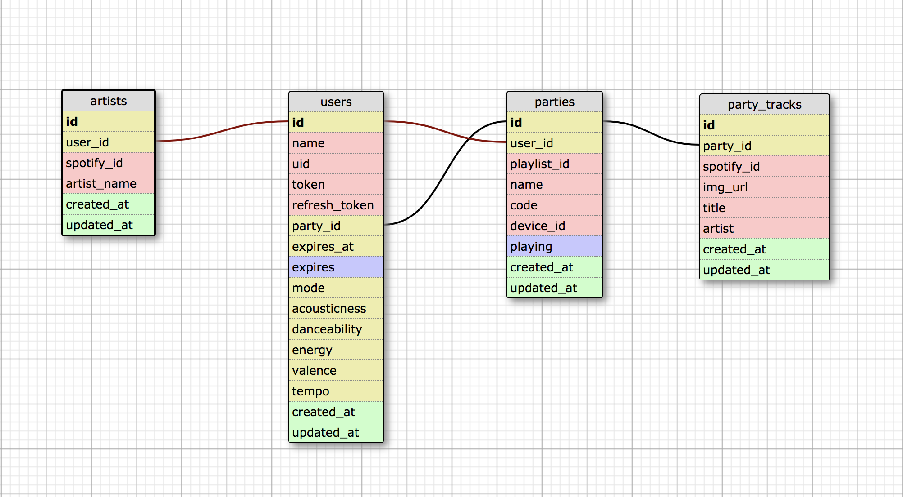

# GroovzApp


### Description
GroovzApp is a mobile friendly web app that allows users to create and join parties. Parties take the music interest of each individual member and builds a unique and dynamic playlist on Spotify. The app gives the host of the party player controls where they can play, pause, and skip songs on Spotify from the app. All members of a party including the host, will see the song that is currently playing, along with the ability to save or remove a song from their Spotify account.
[Checkout our Original Project Pitch](project_pitch.md)


### Use our App
You can try the live app for yourself by visiting [groovzapp.com](http://groovzapp.com).
Sign in using your Spotify(premium) account. You can now start or join parties.
- 'Create Party'

   You will be prompted to choose a name for your playlist and select a device. You will need to have Spotify open on any device of your choosing, this will allow you to control the music playback on the device from our app. You will be provided with a room code that you can give to others to join your party.
- 'Join Party'

  You will be prompted to enter a valid room code that a party host has been provided. Once the code is entered the playlist will now be updated to accommodate your music taste. You will also see the track that is currently playing and have the option to save this track to your Spotify library.

- End/Leave Party

  Once the party is over the host can select 'Shut It Down' at the bottom of their screen to end the party, or individual members can hit 'Bail Out' to leave individually.

### Setup Locally
Clone the repo to your local machine.
1. Run
```
bundle
```
2. Run
```
rake db:{create,migrate}
```
3. Run
```
figaro install
```
4. copy this into your application.yml
```
SPOTIFY_UID: groovzapp
```
5. Spin up a local server by running
```
rails s
```
6. Open your browser and visit 'localhost:3000' and enjoy!

###### Test Suite
If you would like to run our test suite, make sure you've followed steps 1 through 4 above.
Then run
```
rspec
```

### Built With
###### Backend Frameworks
- Ruby
- Rails
- Redis
- PostgreSQL


###### Frontend Frameworks
- HTML
- CSS
- JavaScript

###### Deployment
- Circle CI
- Heroku

###### Testing
-  RSpec
- Capybara
- Simplecov
- VCR's and Webmocks
- Selenium Web Driver

### Authors
- Scott Thomas [Github Profile](https://github.com/smthom05)
- Ty Mazey [Github Profile](https://github.com/tymazey)
- Peter Lapicola [Github Profile](https://github.com/plapicola)
- Tim Allen [Github Profile](https://github.com/timnallen)
